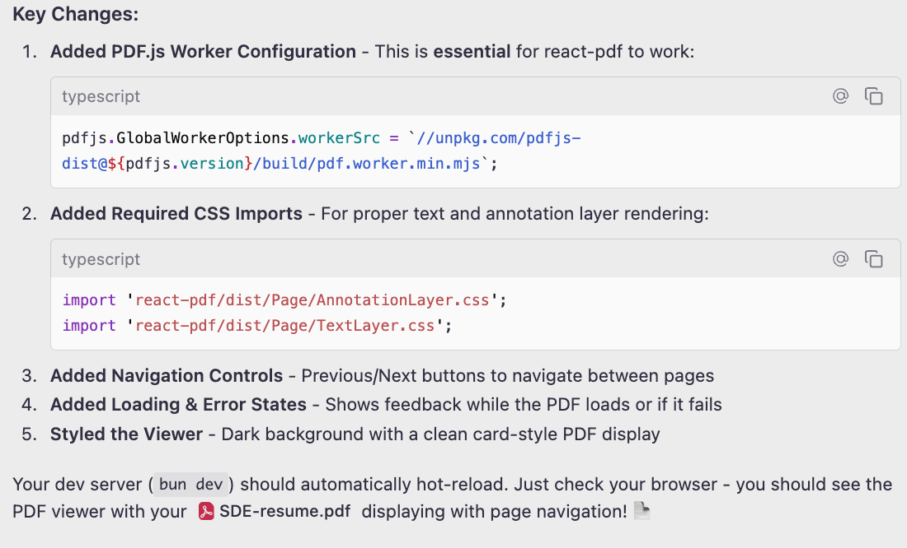
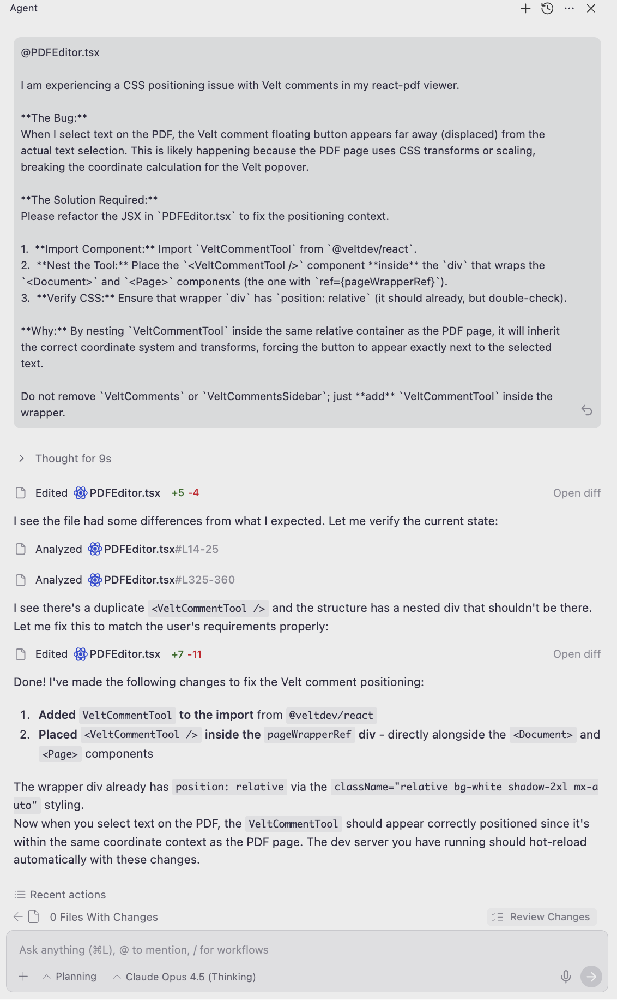

# PDF Reviewer with Velt Collaboration

A PDF Editor-inspired document collaboration app built with Next.js, React-PDF, and Velt, demonstrating real-time inline commenting and multi-user collaboration features on PDF documents.

check it out -> https://velt-pdf-comment.vercel.app/
## 🛠 Tech Stack

| Category             | Technology                            |
| -------------------- | ------------------------------------- |
| **Framework**        | Next.js 16+ (App Router) + TypeScript |
| **PDF Engine**       | react-pdf v10.3.0                     |
| **Collaboration**    | Velt SDK (Text mode)              |
| **Styling**          | Tailwind CSS v4                       |
| **Icons**            | Lucide React                          |
| **State Management** | React Context API                     |

## AI Usage

- **IDE** - Antigravity
- **Model** - Claude sonnet 4.5

### Screenshots

#### Important bit for implementing the PDF to render properly



#### Fixed a UI aligning issue caused by the PDF viewer



## 📋 Prerequisites

- Node.js v18 or higher
- npm v8+ / bun / yarn / pnpm
- A Velt API Key — [Get one free](https://velt.dev)

## 🚀 Getting Started

### 1. Clone the Repository

```bash
git clone <repository-url>
cd adobe-pdf-velt-demo
```

### 2. Install Dependencies

```bash
npm install
# or
bun install
```

### 3. Configure Environment Variables

Create a `.env.local` file in the root directory:

```env
NEXT_PUBLIC_VELT_API_KEY=your_velt_api_key_here
```

💡 **Tip:** Get your API key from the [Velt Dashboard](https://console.velt.dev)

### 4. Start Development Server

```bash
npm run dev
# or
bun dev
```

### 5. Open in Browser

Navigate to `http://localhost:3000`

To switch users, add the `?user=0` or `?user=1` query parameter to the URL.

## 📁 Project Structure

```
adobe-pdf-velt-demo/
├── app/
│   ├── components/
│   │   ├── LeftToolbar.tsx          # Editor tools (Select, Draw, Comment, etc.)
│   │   ├── navbar.tsx               # Top nav with user/theme/download controls
│   │   ├── PDFEditor.tsx            # Main PDF viewing + Velt comments
│   │   ├── UserSwitcher.tsx         # Mock user switching logic
│   │   └── VeltCommentSetup.tsx     # Velt initialization and setup
│   ├── context/
│   │   ├── PDFEditorContext.tsx     # Global state (zoom, page, file, user)
│   │   └── ThemeContext.tsx         # Dark/Light mode state
│   ├── data/
│   │   └── data.ts                  # Mock user data
│   ├── providers/
│   │   └── VeltProviderWrapper.tsx  # Velt provider with user auth
│   ├── globals.css                  # Global styles
│   ├── layout.tsx                   # Root layout
│   └── page.tsx                     # Entry point
├── public/
│   └── research_paper.pdf           # Sample PDF document
└── .env.example                     # Environment variable template
```

## 🔗 Velt Integration

This project demonstrates Velt's integration for adding collaborative features to a React application.

### Velt Components Used

| Component               | Purpose                                                    |
| ----------------------- | ---------------------------------------------------------- |
| `VeltProvider`          | Main provider wrapping the app for Velt SDK initialization |
| `VeltComments`          | Inline text-mode comment overlay on the PDF                |
| `VeltCommentsSidebar`   | Sidebar panel showing all comments in a list view          |
| `VeltSidebarButton`     | Toggle button to open/close the comments sidebar           |
| `VeltPresence`          | Displays active users viewing the document                 |
| `VeltNotificationsTool` | Shows notification bell with comment updates               |

### Velt Hooks Used

| Hook                    | Purpose                                     |
| ----------------------- | ------------------------------------------- |
| `useVeltClient`         | Access to Velt client for document/location |
| `useCommentAnnotations` | Retrieve and manage comment annotations     |

### Integration Logic

Setup handled in `app/providers/VeltProviderWrapper.tsx` and `app/components/PDFEditor.tsx`:

```typescript
// VeltProviderWrapper.tsx - User authentication
<VeltProvider
  apiKey={process.env.NEXT_PUBLIC_VELT_API_KEY}
  authProvider={{
    user: currentUser,
    retryConfig: { retryCount: 3, retryDelay: 1000 },
  }}
>
  {children}
</VeltProvider>

// PDFEditor.tsx - Document & location setup
useEffect(() => {
  if (client && pdfFile) {
    client.setDocuments([{
      id: documentName,
      metadata: { documentName, type: "pdf" },
    }]);
    client.setLocation({
      id: `page-${pageNumber}`,
      locationName: `Page ${pageNumber}`,
    });
  }
}, [client, pdfFile, documentName, pageNumber]);
```

## 🎯 How to Use

1.  **Switch Users**: Click the user avatar in the top right to switch between mock users, or use `?user=0` / `?user=1` URL params.
2.  **Add Comments**: Select text on the PDF or use the Comment tool to add inline comments.
3.  **View Sidebar**: Click the sidebar icon in the navbar to toggle the comments panel.
4.  **Toggle Theme**: Use the Moon/Sun icon in the navbar to switch between light and dark modes.
5.  **Navigate Pages**: Use the arrow buttons in the toolbar to navigate between PDF pages.
6.  **Zoom**: Use the zoom in/out buttons to adjust the PDF view scale.
7.  **Download**: Click the Download button to save the PDF locally.

## 📚 Documentation & Resources

- **Velt**: [Documentation](https://docs.velt.dev) | [API Reference](https://docs.velt.dev/api-reference)
- **React-PDF**: [Documentation](https://github.com/wojtekmaj/react-pdf)
- **Next.js**: [Documentation](https://nextjs.org/docs)
- **Tailwind CSS**: [Documentation](https://tailwindcss.com/docs)
- **Lucide React**: [Icons](https://lucide.dev)
